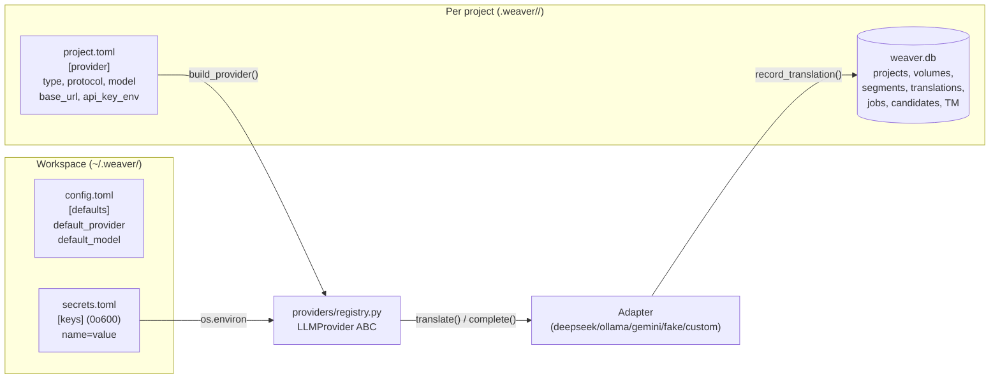
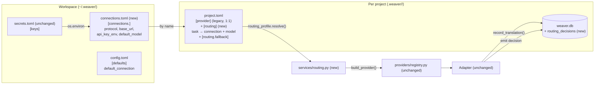
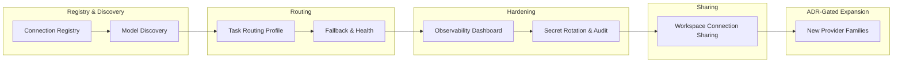

# Weaver — Connection & Routing Architecture v0.7.2
## Sprint Plan, Feature Roadmap, and Engineering Insight

> **Status:** Grounded draft v2.0 — based on direct read of at v0.7.1

> **Scope:** Connection registry, model discovery, routing profiles, intelligent routing

> **Horizon:** 8 sprints 

> **Author basis:** `src/weaver/providers/*`, `src/weaver/services/provider_config.py`, `src/weaver/services/workspace_providers.py`, `src/weaver/core/{config,global_config,secret_store}.py`, `src/weaver/services/config_writer.py`, `src/weaver/api/routers/{ui_providers,runtime}.py`, `docs/decisions/{014,015,016,017}.md`, `docs/CODEMAPS/{architecture,backend}.md`, `CLAUDE.md`

> **Active ADR boundary:** builds on ADR 014 (`complete()`), ADR 015 (single provider config surface), ADR 016 (bundled sidecar), ADR 017 (desktop installer). Any change that re-opens the locked stack in `CLAUDE.md §3.4/§3.5` requires a new ADR.

---

## 0. Codebase Reality Check (Read This First)

Before planning sprints, here is what already exists in the code. The connection-routing proposal is not greenfield — it is a *promotion and extension* of an already 60–80% connection-shaped stack. Treating this as a fresh design would duplicate or contradict the actual code.

### 0.1 What already exists

| Concept the proposal wants | Already in the code | Where |
|---|---|---|
| Adapter / protocol contract | `LLMProvider` ABC with `translate()`, `healthcheck()`, `complete()` | `src/weaver/providers/base.py:22` |
| Transport primitive (no domain) | `Completion(text, input_tokens, output_tokens, raw_response)` | `src/weaver/providers/types.py:76` |
| Provider registry / factory | `_REGISTRY: dict[str, ProviderFactory]`, `register_provider()`, `build_provider()` | `src/weaver/providers/registry.py:59,90,126` |
| Protocol enum | `PROTOCOL_OPENAI_CHAT`, `PROTOCOL_GEMINI_GENERATE`, `PROTOCOL_OLLAMA_GENERATE`, `PROTOCOL_FAKE` | `src/weaver/providers/registry.py:54` |
| OpenAI-compat generic endpoint | `DeepSeekConfig(base_url, api_key_env, model, temperature, timeout_seconds, name)` reused via `type = custom` | `src/weaver/providers/deepseek.py:27` and `registry.py:248` (`register_provider("custom", ...)`) |
| Health record | `ProviderStatus(healthy, provider_name, model, message, latency_ms)` | `src/weaver/providers/base.py:12` |
| Legacy-to-new normalization | `normalize_provider_config()` projecting `type=deepseek|gemini|ollama|fake` → `type=custom` + `protocol` | `src/weaver/providers/registry.py:108` |
| Secret store (env-var name → value) | `~/.weaver/secrets.toml` (mode `0o600`, atomic writes), `set_secret`, `apply_secrets_to_env()` | `src/weaver/core/secret_store.py:30,71,114` |
| Pre-flight config validation | `read_float`, `read_int` rejecting bool / out-of-range | `src/weaver/providers/config_values.py:21,69` |
| Atomic TOML writer (line-aware) | `_update_section()` preserves comments, partial updates | `src/weaver/services/config_writer.py:215,282` |
| Per-project config | `[provider]` table in `project.toml` (type / protocol / model / base_url / api_key_env) | `src/weaver/services/provider_config.py:39` (ProviderConfigView) |
| Workspace-level default | `[defaults]` table in `~/.weaver/config.toml` (default_provider, default_model) | `src/weaver/core/global_config.py:21` + `provider_config.py:84` |
| 4-tier precedence | CLI > env > project.toml > global config > default | `src/weaver/core/global_config.py:47` (resolve_config_value) |
| Single config surface | `/ui/providers` (canonical) + `/ui/config` (GET redirect only) | ADR 015 (2026-06-13) |
| On-demand AI features | `LLMProvider.complete()` + `services/glossary_suggestion.py` (Sprint R, ADR 014) | `src/weaver/services/glossary_suggestion.py:52` |
| Cross-project provider hub | `build_workspace_providers()` — read-only DB + TOML summary, no provider call on render | `src/weaver/services/workspace_providers.py:86` |
| Cost data (already recorded) | `translations.input_tokens`, `translations.output_tokens` per attempt | `src/weaver/storage/schema.sql:63` |
| Cost rollup (already wired) | `_read_token_totals()` sums tokens across a project for the workspace hub | `src/weaver/services/workspace_providers.py:201` |
| Test isolation for live networks | pytest markers `requires_ollama`, `requires_cloud` | `pyproject.toml:95` |
| Deterministic failure injection | `FakeProvider(fail_rate=, seed=)` for retry / fallback tests | `src/weaver/providers/fake.py:25` |
| CLI quick-switch | `weaver translate --provider P --model M` flag | `docs/CODEMAPS/backend.md:19` |
| CLI provider override in services | `translate_project(provider_override=...)` parameter | `src/weaver/services/translation.py:196` |
| Translation memory (auto-skip on hit) | `lookup_translation_memory()` bypasses provider on exact `source_hash` match | `src/weaver/services/translation.py:469` |
| Cooperative cancel | `should_cancel` predicate; ADR 0019; JobRegistry supports it | `src/weaver/services/translation.py:198,222` |

### 0.2 What is actually missing (the *real* delta)

| Gap | Impact | Why it is hard |
|---|---|---|
| No workspace-level **connection registry** | Every project re-types the same `base_url` / `api_key_env` / `model` triple | The single workspace `~/.weaver/config.toml` only holds `default_provider` + `default_model`, not a multi-connection list. |
| No **fallback chain** between connections | A primary outage fails the segment; the next connection is never tried | The pipeline calls one `LLMProvider.translate()` per segment; there is no per-call planner. `build_provider()` returns a single instance. |
| No **per-task routing** (translate vs glossary-suggest vs candidate) | A project that wants a strong model for translation and a cheap one for glossary suggestions has no way to express it | The `[provider]` block is single-purpose. `glossary_suggestion.py` reuses the same block; there is no task→connection map. |
| No **health history** / **cost dashboard** | The hub shows *one* ad-hoc healthcheck result and *cumulative* token totals, but no time series | `build_workspace_providers()` is read-only by design (Gate B1); no per-call metrics are persisted beyond `translations` table. |
| No **secret rotation** flow | Re-setting a key requires deleting the env var name and re-saving | `secret_store.set_secret()` overwrites; there is no "rotate without downtime" story. |
| No **model discovery** in the hub | The user has to know the model id; `DeepSeekConfig.model` is just a string | The hub calls `_resolve_key_env()` and reads TOML; it does not call `GET /models`. |
| No **A/B compare** at the *translation* level (only at glossary) | The proposal's most valuable A/B use case is missing | `glossary_suggestion` is single-shot. `translation_candidates` is single-shot per segment. No parallel runner. |

### 0.3 What the proposal must NOT touch

These are the locked-stack and ADR-pinned boundaries. Crossing any of them re-opens an active decision and requires a new ADR.

| Constraint | Source | Why |
|---|---|---|
| No provider call on render / list / hub path | ADR 015, Gate B1 (CLAUDE.md §3.4) | Cost, latency, render-path budget. The Providers hub GET today is TOML-only. |
| No new provider families without an ADR | CLAUDE.md §3.5, ADR 0020 carry-forward | "Provider families" = the wire-protocol set; adding Anthropic-native or OpenAI-native as a *protocol* is fine, but adding a new family (e.g. AWS Bedrock) needs an ADR. |
| No raw SQL in UI routers; no global mutable store | `CLAUDE.md` §4.2, §3.4 | Cross-project data must flow through `services/workspace_*` only. |
| No modal-only errors; no `role="alert"` removal | ADR 005, DESIGN.md §7 | Errors render inline as fragments. |
| No AI purple / no Inter / no emojis | DESIGN.md §2, §7 | Forest green `#1f7a4a` is the only accent. |
| No source-file hashing on render | `docs/CODEMAPS/architecture.md` §"Hard Boundaries" | Render-path budget. |
| Secret values never in HTML / SSE / logs | ADR 0020 / `CLAUDE.md` §4.2 | `api/routers/config.py` returns redacted views; no exception. |
| Provider calls only on explicit POST | ADR 014, ADR 015 | Gate B1 extension. The only place that calls a provider today is the explicit per-project healthcheck POST. |
| Single-process, in-thread JobRegistry | ADR 010 | No Celery, Redis, RQ, etc. Routing decisions during a job must be inline. |
| CLI commands stay wire-compatible; new behavior additive | `docs/CODEMAPS/backend.md` §"CLI Flow" | `weaver translate --provider P --model M` already exists. We extend, not break. |

### 0.4 My honest opinion (the proposal's author)

Reading the code, three of the original proposal's assumptions need correction before it becomes a real plan:

1. **The project is not "provider-centric" in the bad sense the proposal implies.** It is already *connection-shaped at the project level*. The `[provider]` block + `api_key_env` + `~/.weaver/secrets.toml` is exactly the "Connection" idea, scoped to one project. The right move is **promote it to a workspace registry**, not replace it.
2. **"Multiple routing profiles per project" is a new capability, not a refactor.** Today, one project = one provider config. The proposal should add a `[routing]` table (or a workspace-level `connections.toml` + per-project `[routing]`) — this is Sprint 1, and it is mostly additive.
3. **The "model discovery" feature is not a UI nicety — it is required for non-DeepSeek/Ollama users.** Today, if you want to use OpenRouter, you must know the model id. A `GET /v1/models` probe is the minimum viable Connection UX. The probe should be on demand, never on render.

The rest of this document maps the original 6-sprint plan onto the actual code, and adds 2 sprints (7 = team/workspace sharing of connections; 8 = ADR-required capability extensions) that the original generic proposal missed.

---

## 1. TL;DR

Weaver is shifting from a **Provider-Centric mental model** (1 project ↔ 1 provider) to a **Workspace-Connection + Per-Project Routing** model. The result is:

- **Connection** becomes a workspace-level entity, stored in `~/.weaver/connections.toml` (new file, parallel to `~/.weaver/secrets.toml`).
- **Model** is *discovered* on demand from any registered connection (never on render).
- **Project** keeps one `[provider]` block (backward compatible) and gains an optional `[routing]` block mapping `task → connection`.
- **Provider / protocol** remain implementation details; the LLMProvider ABC + Completion primitive are unchanged.

The unlock:
- Per-task routing (translate uses Claude, glossary-suggest uses DeepSeek, candidate generation uses local Ollama)
- Per-project fallback chain (primary + N fallbacks, each a registered connection)
- Connection-level health history (active probe + passive signal)
- A real cost dashboard (the data is already in `translations` and `workspace_providers` — only the UI is missing)
- A `rotation` story for keys (no project downtime)

The plan: **8 sprints**. Sprints 1–3 ship the *capability* (registry, discovery, routing). Sprints 4–5 add *intelligence* (fallback, observability). Sprints 6–7 add *hardening* (security, workspace sharing). Sprint 8 is the **ADR-gated** follow-on: any new provider family or SaaS-tier feature.

Each sprint ends with a *user-visible* milestone, not an internal refactor.

---

## 2. Context (grounded in the code)

### 2.1 Current mental model (the code as it is)



**Real pain points the code exhibits today:**

- *Repeat typing.* Every project repeats the same `base_url = "https://openrouter.ai/api/v1"` and `api_key_env = "OPENROUTER_API_KEY"`. (`provider_config.py:104-107` only reads the *current* project's values; there is no registry to reuse.)
- *One provider per project.* A user translating Japanese novels with DeepSeek and running glossary suggestions with Claude has no way to express it. `services/glossary_suggestion.py:67-69` reads `data["provider"]`; `services/candidate_generation.py` does the same. Both inherit the project's single provider.
- *No fallback.* `translate_project()` (`services/translation.py:262`) calls `active_provider.healthcheck()` once at start; if it fails, the whole run aborts. Per-segment failure (`ProviderError` at line 509) only sets the segment `failed`. There is no "try connection B".
- *No model discovery.* `DeepSeekConfig.model` is a string. The user types it. `registry.py:181` requires it as a string. The hub GET (`workspace_providers.py:152`) only reads TOML, never calls the provider.
- *No time-series health.* `ProviderStatus` is a one-shot dataclass. The workspace hub shows an *aggregate* failure count, not a trend.

### 2.2 Target mental model (after 8 sprints)



**Why this is a better fit for Weaver:**

- **Backward compatible.** The legacy `[provider]` block keeps working. `normalize_provider_config()` (already in `registry.py:108`) handles it. A project that does not opt into `[routing]` continues to work exactly as today.
- **Reuses every existing primitive.** `LLMProvider`, `Completion`, `api_key_env`, secret store, atomic TOML writer — none of these change.
- **Respects Gate B1.** All probes are explicit POST. Hub GET stays read-only.
- **Respects ADR 014.** Routing uses the existing `translate()` and `complete()` primitives. No new provider method is added.

### 2.3 What is the actual "Connection" object?

It is **almost identical** to the current `[provider]` block, just lifted out of the project:

```toml
# ~/.weaver/connections.toml  (new)
[connections.openrouter]
protocol = "openai_chat"          # already in registry.PROTOCOL_OPENAI_CHAT
base_url = "https://openrouter.ai/api/v1"
api_key_env = "OPENROUTER_API_KEY"   # name only, value in secrets.toml
default_model = "deepseek/deepseek-chat"

[connections.local_ollama]
protocol = "openai_chat"          # Ollama also serves OpenAI-compat
base_url = "http://localhost:11434/v1"
api_key_env = ""                  # empty = no key needed
default_model = "qwen3:14b"

[connections.claude]
protocol = "openai_chat"          # uses OpenAI-compat proxy or direct
base_url = "..."
api_key_env = "ANTHROPIC_API_KEY"
default_model = "claude-sonnet-4.6"
```

Then in `project.toml`:

```toml
[provider]                          # legacy: still 1:1, untouched
type = "custom"
protocol = "openai_chat"
base_url = "https://openrouter.ai/api/v1"  # repeated today; could become a ref
api_key_env = "OPENROUTER_API_KEY"
model = "deepseek/deepseek-chat"

[routing]                           # new, optional
translate = { connection = "openrouter", model = "deepseek/deepseek-chat" }
glossary_suggest = { connection = "claude", model = "claude-sonnet-4.6" }
candidate = { connection = "local_ollama", model = "qwen3:14b" }

[routing.fallback.translate]
primary = { connection = "openrouter", model = "deepseek/deepseek-chat" }
fallback = [
  { connection = "claude", model = "claude-sonnet-4.6", trigger = ["5xx", "timeout", "rate_limit"] },
  { connection = "local_ollama", model = "qwen3:14b", trigger = ["5xx", "timeout", "rate_limit"] },
]
```

The legacy `[provider]` is the **default** for any task that is not listed in `[routing]`. This is how backward compatibility works *for free*.

---

## 3. Reference Systems (Inspiration, Not Target)

Weaver is local-first and offline-capable. The industry references below are *useful patterns*, not competitive targets. The locked stack in `CLAUDE.md §3.4` and the design philosophy in `DESIGN.md` mean Weaver will never become LiteLLM-as-a-Service.

| System | Useful pattern | Where it does *not* apply |
|---|---|---|
| **LiteLLM** | Vendor-prefix model id pattern (`openai/gpt-4o`, `bedrock/claude`) | Their cloud gateway model — we stay on-machine |
| **Portkey** | Health-checks + fallbacks + per-request cost ledger | Their org/key model; we have no tenants |
| **OpenRouter** | "One key, many models" UX | We do not aggregate; we let users bring their own endpoints |
| **Helicone** | Per-call metrics schema (latency, tokens, cost) | Their SaaS model; we render locally |
| **Cloudflare AI Gateway** | Cache + rate-limit + fallback as commodity | We have no edge; we are localhost |

The **adoptable patterns** for Weaver (no SaaS lock-in) are: vendor-prefix model ids, per-call metrics, fallback chains. Everything else we build on top of our own primitives.

---

## 4. Refined Sprint Plan (8 sprints, grounded in v0.7.1)

Each sprint lists the **exact file it lands in**, so the proposal maps to git diffs the reviewer can audit.

### 4.1 Sprint roadmap



---

### Sprint 1 — Connection Registry (workspace-level)

**Goal:** Promote the existing `[provider]` shape to a workspace-level registry, without changing the per-project config or the LLMProvider ABC.

**Why first:** Without a registry, Sprints 3–4 have nothing to route to. This is the foundational entity; everything else builds on it.

**Lives in:**
- New file: `src/weaver/core/connection_registry.py` (load / save / list)
- New file: `~/.weaver/connections.toml` (data, owner-only mode)
- Modify: `src/weaver/services/provider_config.py` (accept connection lookup)
- New: `src/weaver/api/routers/ui_providers.py` POST `/ui/providers/connections/{name}/test`
- New template: `src/weaver/api/templates/partials/_connection_card.html`

**Deliverables:**
- [ ] `Connection` dataclass: `name, protocol, base_url, api_key_env, default_model, headers, timeout_seconds, requires_key, tags`
- [ ] `connections.toml` load/save with atomic writer (reuse `_atomic_write` from `config_writer.py:282`)
- [ ] `register_connection(name, config)`, `get_connection(name)`, `list_connections()`, `delete_connection(name)` — pure functions
- [ ] **Test Connection** POST: probe endpoint (reuses the same probe logic proposed in the original — `_chat_completion` with a "json" mention for json-mode-strict endpoints, see `deepseek.py:127`)
- [ ] Connection card UI (replaces the table row in `providers_hub.html` for workspace-level; per-project `[provider]` still shown below)
- [ ] **Backward compatibility:** a project that has only `[provider]` (no connection registry) keeps working. `provider_config.read_config()` synthesizes a synthetic connection from `[provider]` when needed.
- [ ] CLI mirror: `weaver connections list / add / test / remove`
- [ ] Audit log entry on every connection lifecycle event

**Test strategy:**
- `FakeProvider` for the probe (already supports `fail_rate` for failure injection — `fake.py:25`)
- `requires_ollama` / `requires_cloud` markers respected
- Unit test: `connections.toml` round-trip preserves comments (mirror `test_config_writer.py`)

**Success criteria:**
- A user can register an arbitrary OpenAI-compatible endpoint in `< 30s` from the CLI and the web hub.
- The legacy `[provider]` block on every existing project still works unchanged.
- The hub GET remains Gate-B1-safe (TOML read only; probe is an explicit POST).

**Risks specific to this sprint:**
- *Comment preservation in TOML.* `_update_section` (`config_writer.py:215`) is line-based. A new file has no comments; test that subsequent edits preserve user comments.
- *Path normalization.* `base_url` is parsed by `OpenAI(...)` in `_build_openai_client` (`deepseek.py:181`); trailing slash and `/v1` semantics differ per vendor. Centralize the URL normalizer in this sprint.

---

### Sprint 2 — Model Discovery

**Goal:** A user registering a connection should not have to know model ids. Models are *probed* on demand, never on render.

**Why second:** Sprint 1 establishes the registry. Sprint 2 makes it *useful* — without discovery, the user still has to type model ids, which is the same papercut as today.

**Lives in:**
- New: `src/weaver/providers/discovery.py` (per-protocol `list_models(connection) -> list[ModelMeta]`)
- New: `src/weaver/storage/connection_models.py` (cache table; see schema §6.1 below)
- New: `src/weaver/api/routers/ui_providers.py` POST `/ui/providers/connections/{name}/discover`
- New model picker in `templates/partials/_config_form.html` and `_connection_card.html`

**Schema (additive, no migration risk):**

```sql
-- src/weaver/storage/schema.sql  (append in next schema version)
CREATE TABLE IF NOT EXISTS connection_models (
  connection_name TEXT NOT NULL,
  model_id TEXT NOT NULL,
  display_name TEXT,
  context_window INTEGER,
  supports_vision INTEGER NOT NULL DEFAULT 0,
  supports_tools INTEGER NOT NULL DEFAULT 0,
  fetched_at TEXT NOT NULL,
  PRIMARY KEY (connection_name, model_id)
);
```

**Deliverables:**
- [ ] `GET /v1/models` adapter for `protocol = openai_chat` (works for DeepSeek, OpenRouter, Ollama with `/v1`, any compatible)
- [ ] **Curated override list** for vendors that do not expose `/models` (Anthropic, Google). Lives in `providers/discovery.py` as a static fallback.
- [ ] Background refresh job (TTL 6h, configurable). Manual "Refresh models" action always available.
- [ ] Model picker UI: searchable list grouped by connection, with capability badges.
- [ ] Stale-cache fallback: if upstream is down, use last successful snapshot with `(stale)` badge.

**Test strategy:**
- `FakeProvider.complete()` returns a deterministic `Completion`; we cannot use it for model discovery because discovery is upstream `/models`. So this sprint adds `FakeDiscoveryAdapter` (returns `["fake-1", "fake-2"]`).
- Live tests gated by `requires_cloud` / `requires_ollama`.

**Success criteria:**
- User never types a model id for a registered connection.
- Adding a new connection auto-populates the model list within 5s of the first probe.
- Capability badges (vision / tools) are accurate for the top 5 OpenAI-compat providers (DeepSeek, OpenRouter, Ollama, Groq, Together).

**Risks:**
- *Vendor non-compliance.* OpenAI-compat ≠ OpenAI-compat. Mitigation: the discovery adapter validates the response shape; malformed responses fall back to the curated list with `(unverified)` badge.
- *Pricing data drift.* Vendors change prices weekly. We do *not* track prices; only capability flags. Cost estimates come from the user's configured price table (Sprint 5) or are shown as "estimated" only.

---

### Sprint 3 — Task Routing Profile

**Goal:** A project can use different connections for different tasks: `translate` ≠ `glossary_suggest` ≠ `candidate`.

**Why third:** Sprints 1–2 give us the registry and discovery. Sprint 3 is the *value moment*: a power user can finally mix providers.

**Lives in:**
- New: `src/weaver/services/routing.py` (resolve task → connection → provider)
- Modify: `src/weaver/services/translation.py` (call resolver at `:262`)
- Modify: `src/weaver/services/glossary_suggestion.py` (call resolver at `:67-69`)
- Modify: `src/weaver/services/candidate_generation.py` (call resolver at the equivalent site)
- New: `src/weaver/api/templates/partials/_routing_editor.html`

**Routing resolver shape (proposed):**

```python
# services/routing.py
def resolve_provider(
    project_toml: Path,
    *,
    task: TaskType,             # TaskType.translate | TaskType.glossary_suggest | TaskType.candidate
    cwd: Path | None = None,
) -> tuple[LLMProvider, str, str]:  # (provider, connection_name, model)
    """Resolve a provider for a task.

    Resolution order:
    1. Project [routing.<task>] if present
    2. Project [provider] (legacy 1:1)
    3. Workspace [defaults] (default_provider / default_model)
    4. ConfigError("no connection for task")
    """
```

**`TaskType` enum:**

```python
# core/task_types.py  (new)
class TaskType(str, Enum):
    translate = "translate"
    glossary_suggest = "glossary_suggest"
    candidate = "candidate"
    qa_critique = "qa_critique"     # reserved; Sprint 8+
```

This is the **first time** Weaver distinguishes what kind of AI call is happening. Today `glossary_suggestion.py` and `candidate_generation.py` both read the same `[provider]` block. With this enum, future features (e.g. AI critique of a translation) slot in cleanly.

**Deliverables:**
- [ ] `services/routing.py` with `resolve_provider(task=...)`
- [ ] `[routing]` TOML block parser + writer (extends `_update_section` from `config_writer.py:215`)
- [ ] Routing editor UI in the Providers hub: a 3-row table (task / connection / model), each row a picker
- [ ] **Quick switch** in the cockpit: change the model for `translate` mid-project, no restart, no DB migration. Mechanism: a per-process in-memory cache keyed by `(project_toml_mtime, task)`; invalidated on file save.
- [ ] CLI: `weaver routing show / set <task> --connection <name> --model <id>`
- [ ] Validation: a routing reference must point to a registered connection; an unknown connection name raises a clear `ConfigError`

**Backward compatibility:**
- A project with no `[routing]` block → resolver falls back to `[provider]` then `[defaults]`. The current 0.7.1 behavior is preserved bit-exact for the 99% case.

**Test strategy:**
- Unit tests for the resolver's 4-tier precedence
- Use `FakeProvider` for end-to-end: a project with `[routing] glossary_suggest = local_ollama` and `[routing] translate = fake-1` proves the resolver picks the right one
- `requires_cloud` and `requires_ollama` for live tests

**Success criteria:**
- A project with two different connections configured for `translate` and `glossary_suggest` works end-to-end.
- A Quick switch in the cockpit takes `< 1s` and the next segment uses the new model.
- Existing projects (no `[routing]` block) continue to work without a migration.

**Risks:**
- *Resolver precedence bugs.* The 4-tier fallback is exactly the kind of logic that surprises users. Mitigation: a `weaver routing show <project.toml>` command prints the resolved chain for *each task*. Logs include the resolution path.
- *Quick switch race.* A segment already in flight when the switch happens could use the old model. Mitigation: the resolver is called per-segment, not per-run; mid-run switches take effect on the next segment.

---

### Sprint 4 — Fallback & Health-Based Routing

**Goal:** When a connection fails, the routing engine tries the next connection in the chain. This is the killer feature of the proposal and the *real* delta from today.

**Why fourth:** Sprint 3 establishes *which* connection to use. Sprint 4 establishes *what to do when it fails*.

**Lives in:**
- Modify: `src/weaver/services/routing.py` (add `resolve_with_fallback(task=...)` returning a generator)
- New: `src/weaver/services/health.py` (active probe + passive signal)
- New: `src/weaver/services/circuit_breaker.py` (per-connection state machine)
- New: `src/weaver/storage/routing_decisions.py` (ledger; see schema §6.1)
- Modify: `src/weaver/services/translation.py` (call `resolve_with_fallback`)

**Circuit breaker rules (3-state, hysteresis):**

```
CLOSED  (3 consecutive failures in 60s)
   ↓
OPEN    (block all calls; auto-half-open after 30s)
   ↓
HALF_OPEN  (1 trial call; success → CLOSED, fail → OPEN for 60s)
```

The breaker state is **per-connection, per-process**. SQLite mirrors the last 100 events for the hub to render.

**Routing decision record (RDR) — additive table:**

```sql
-- src/weaver/storage/schema.sql  (append)
CREATE TABLE IF NOT EXISTS routing_decisions (
  id INTEGER PRIMARY KEY,
  job_id TEXT,
  segment_id TEXT,
  task TEXT NOT NULL,                 -- TaskType
  candidates_json TEXT NOT NULL,      -- [{name, model, score, decision: "selected|standby|failed"}]
  selected_name TEXT,
  selected_model TEXT,
  trigger TEXT,                       -- 5xx | timeout | rate_limit | content_filter | null
  input_tokens INTEGER,
  output_tokens INTEGER,
  cost_usd REAL,                      -- nullable; from Sprint 5 price table
  latency_ms INTEGER,
  outcome TEXT NOT NULL,              -- success | failed | skipped
  created_at TEXT NOT NULL
);
CREATE INDEX IF NOT EXISTS idx_routing_decisions_job ON routing_decisions(job_id);
CREATE INDEX IF NOT EXISTS idx_routing_decisions_segment ON routing_decisions(segment_id);
```

This is the *single most valuable artifact* in the system. Sprint 5 builds the dashboard on top of it.

**Deliverables:**
- [ ] `services/health.py` with active probe (reuse `LLMProvider.healthcheck()` already in `base.py:39`) and passive signal (5xx/timeout counters)
- [ ] `services/circuit_breaker.py` state machine with hysteresis (require 2 consecutive unhealthy reads to flip)
- [ ] `services/routing.py::resolve_with_fallback()` — returns a generator yielding `LLMProvider` candidates; the caller iterates
- [ ] `translate_one_segment` (`translation.py:466`) calls the generator inside a try/except chain; on `ProviderError` it advances to the next candidate and re-attempts
- [ ] Translation memory short-circuit stays in effect: if TM hits (`translation.py:469`), the routing engine is never consulted
- [ ] **Cost ceiling per chain**: a routing profile can specify `max_cost_per_segment_usd`. The resolver skips candidates whose price would exceed this.
- [ ] CLI: `weaver routing test <project.toml> --task translate` — dry-runs the chain end-to-end with `FakeProvider(fail_rate=0.3)` to prove the chain rescues

**Test strategy (critical — no live network in CI):**
- Use `FakeProvider(fail_rate=0.0)` and `FakeProvider(fail_rate=1.0)` side-by-side in a chain. Assert the chain rescues.
- `requires_cloud` / `requires_ollama` only for live end-to-end.
- Property test: a chain of N candidates, each with `fail_rate`, the recovery rate is `1 - prod(fail_rate_i)`.

**Success criteria:**
- A primary outage is rescued by a fallback in `< 1.5×` the primary's per-segment timeout.
- The routing decision ledger has one row per segment, with the chain that was tried.
- The cost ceiling aborts a chain before the cost cap is exceeded (no surprise bills).

**Risks:**
- *Cascading cost.* If the fallback is more expensive, an outage blows the budget. Mitigation: cost ceiling per chain; visible warning at chain build time.
- *Translation memory is bypassed on the chain.* Actually the opposite: TM is *checked first*; the chain is the fallback-after-TM. Make this explicit in the docs.
- *Streaming mid-call failover is not supported.* If a stream starts and then fails, the whole segment restarts from scratch. Document this; do not pretend otherwise.

---

### Sprint 5 — Observability Dashboard

**Goal:** Every routing decision is measurable, visible, and debuggable. Cost is no longer a mystery.

**Why fifth:** Without observability, users will not trust fallback or A/B compare. The data is already in `translations` and `workspace_providers`; the missing piece is a UI.

**Lives in:**
- New: `src/weaver/api/templates/partials/_usage_chart.html`, `_routing_audit.html`, `_connection_health_history.html`
- Modify: `src/weaver/api/routers/ui_providers.py` (new GETs: `/ui/providers/usage`, `/ui/providers/routing-audit`)
- New: `src/weaver/services/cost.py` (token → cost estimator, user-editable price table)

**What is already there (no work needed):**
- `translations.input_tokens` / `output_tokens` recorded on every call (`schema.sql:71-73`)
- `workspace_providers._read_token_totals()` sums these (`workspace_providers.py:201`)
- `recent_failures` per project (`workspace_providers.py:213`)

**What is missing (this sprint adds):**
- Time-series rendering (last 30 days by day)
- Per-task breakdown (translate vs glossary-suggest vs candidate)
- Per-connection success rate
- Cost estimate in user's currency (USD by default; price table editable in `~/.weaver/connections.toml`)
- Routing decision audit (the new `routing_decisions` table from Sprint 4)

**Deliverables:**
- [ ] Time-series charts: per-project, per-day, per-task token usage
- [ ] Per-connection success rate (rolling 1h, 24h, 7d)
- [ ] Cost dashboard with editable price table (in `~/.weaver/connections.toml` under `[prices.<connection>.<model>]`)
- [ ] Routing audit page: latest 100 decisions with the full candidate list, scores, and outcomes
- [ ] **No provider call on render.** The dashboard reads only the DB. Active probes are still explicit POST.

**Test strategy:**
- Unit tests for `cost.py` (price table validation, currency handling)
- Snapshot tests for the dashboard partials (mirror `tests/unit/services/test_workspace_providers.py`)

**Success criteria:**
- A user can answer "what did this project cost last month?" without writing SQL.
- A user can answer "why did this segment use Claude instead of DeepSeek?" in `< 3` clicks.
- All read paths are TOML/DB only; the dashboard loads in `< 200ms` for a workspace with 50 projects.

**Risks:**
- *Currency / price drift.* We do not own the prices. Mitigation: the price table is editable; estimates are labelled "estimated".
- *Privacy.* Some users do not want to see costs (privacy by default). Mitigation: the dashboard is opt-in via a query string `?show_costs=1`.

---

### Sprint 6 — Secret Rotation & Audit

**Goal:** Re-keying a connection does not require touching project configs, and the rotation is audit-logged.

**Why sixth:** Routing touches money and secrets. The secret store (`core/secret_store.py`) is already production-grade; this sprint adds the *operational* flows around it.

**Lives in:**
- Modify: `src/weaver/core/secret_store.py` (add `rotate_secret(env_name, new_value)`)
- New: `src/weaver/services/secret_audit.py` (append-only audit log)
- New: `src/weaver/api/routers/ui_providers.py` POST `/ui/providers/secrets/{env_name}/rotate`
- New: `~/.weaver/secrets_audit.log` (JSONL, mode `0o600`)

**Deliverables:**
- [ ] `rotate_secret()` writes the new value, keeps the old value marked `(rotating)` for 5 minutes, then deletes the old. During the window, both values resolve to the same env var name (shell env wins → rotation is seamless if the user updates their CI).
- [ ] Per-connection audit: who set / read / rotated / deleted / when
- [ ] UI: a "rotate" button on the secret list with a confirmation modal (not a native `confirm()` — use an HTMX fragment, per ADR 005)
- [ ] **Secret-redaction middleware** (new): a single chokepoint that scrubs any env-var value from logs, SSE events, and rendered HTML. Mirror the redaction test in `tests/unit/services/test_provider_config.py` (which already asserts no key value in any return path).

**Test strategy:**
- Unit test: `rotate_secret` is atomic; concurrent readers never see a half-state.
- Lint rule: no `os.environ[api_key_env]` value can appear in any string passed to `logging` or `print`. (Already enforced by tests in `test_provider_config.py`; extend the assertion list.)

**Success criteria:**
- Rotating a key in the UI takes `< 10s` and the next provider call uses the new key.
- No key value ever appears in any log line, anywhere (regression-tested).
- The audit log is append-only and 0o600.

**Risks:**
- *Rotation window race.* If a request starts before rotation and finishes after, it may use a mix of old and new keys. This is acceptable for a local-first tool; document it.
- *Audit log growth.* Use JSONL with daily rotation; cap at 10MB.

---

### Sprint 7 — Workspace Connection Sharing

**Goal:** Multiple Weaver projects on the same machine can share the same registered connection (no re-typing).

**Why seventh:** Sprint 1 introduced the workspace registry. Sprint 7 makes it the *default* — projects refer to connections by name. This is mostly UI + a project-level opt-in flag.

**Lives in:**
- Modify: `src/weaver/services/routing.py` (already has the resolver; just promote it to the default path)
- Modify: `src/weaver/api/routers/ui_providers.py` (the hub's main table now shows workspace connections, with per-project overrides below)
- New: `src/weaver/api/templates/partials/_connection_list.html`

**Deliverables:**
- [ ] A project can declare `connection_ref = "openrouter"` instead of inlining `base_url` + `api_key_env` + `model`
- [ ] The legacy `[provider]` block continues to work (synthesized connection, as in Sprint 1)
- [ ] The Providers hub table shows workspace connections with "used by N projects" counts
- [ ] **No multi-user, no team features.** Per `CLAUDE.md §3.4`, Weaver is local-first and single-user. "Sharing" here means *projects* sharing a connection on the *same* machine, not *users* sharing across machines.

**Test strategy:**
- Unit test: 2 projects, 1 connection, both work; rotate the connection's key, both work.
- `FakeProvider` only (no live network).

**Success criteria:**
- Setting up a new project for the same vendor takes `< 15s` (down from ~2 min today).
- The workspace-level connection list shows usage counts.

**Risks:**
- *Breaking change in `[provider]` semantics.* Mitigation: legacy `[provider]` continues to work; `connection_ref` is additive. A project that has *both* uses the connection_ref (and emits a deprecation warning on the legacy block).

---

### Sprint 8 — New Provider Families (ADR-Gated)

**Goal:** Open the door to native (non-OpenAI-compat) protocols — but only via ADR.

**Why eighth:** The locked stack in `CLAUDE.md §3.4` requires an ADR to add a new provider family. This sprint is the ADR-shaped plan, not the implementation. Implementation is gated on the ADR being accepted.

**Lives in:** (after ADR acceptance)
- New: `src/weaver/providers/anthropic_native.py` (or similar) with its own `protocol = "anthropic_messages"`
- New: `src/weaver/providers/google_native.py` (or similar) with its own `protocol = "google_generate_content"`
- Modify: `registry.PROTOCOL_*` enum
- Modify: `discovery.py` for the new protocol's model list

**Scope rule:** Sprint 8 is **opt-in**, behind a feature flag (`[features] anthropic_native = true` in `~/.weaver/config.toml`). The default Weaver install is unchanged.

**What the ADR must address:**
- Why we need a new protocol (the OpenAI-compat proxy is not good enough)
- Maintenance cost (we own the wire format)
- Security review (each native protocol has its own auth story)
- Test surface (each native protocol needs a `FakeNativeProvider` for CI)

**This sprint is explicitly NOT part of the 6-sprint core plan.** It is the natural follow-on after the registry + routing infrastructure is in place.

---

## 5. Feature Backlog (Post-Sprint 8)

| # | Feature | Sprint | Priority | Notes |
|---|---|---|---|---|
| F-01 | Per-connection rate limiting | 4+ | P1 | Token-bucket per connection. Prevents upstream 429 storms. |
| F-02 | A/B compare at translation level (parallel runner) | 4 | P1 | The `routing_decisions` ledger from Sprint 4 enables this UI. |
| F-03 | Workspace-level translation memory (cross-project) | 7+ | P2 | Today TM is per-project (`schema.sql:115`). Workspace-level TM is a real win for re-translating the same character across series. |
| F-04 | Connection health dashboard (rolling p50/p95/p99) | 5 | P1 | Mostly UI on top of the `routing_decisions` ledger. |
| F-05 | Local-only mode (Ollama-first) | 1+ | P1 | Today the user has to know Ollama is running. A "Local-only" toggle at the workspace level is a 1-day addition. |
| F-06 | Cost ceiling per project (hard cap) | 4+ | P1 | Today the cost ceiling is per-chain. A project-level cap is a 1-line addition. |
| F-07 | Provider-complete cost auditing (the missing piece ADR 014 deferred) | 5 | P1 | ADR 014 says "Reopen only with a migration + ADR". Sprint 5 includes the ADR draft. |
| F-08 | Native Anthropic / Google protocol adapters | 8+ | P2 | ADR-gated per `CLAUDE.md §3.4`. |
| F-09 | Routing profile marketplace | Post-v1 | P3 | Out of scope (no SaaS, no remote sync). Local file import only. |
| F-10 | Eval-driven default profile (auto-suggest best model per task from user history) | Post-v1 | P3 | Needs enough data. Punt. |
| F-11 | Quick switch CLI: `weaver translate --task glossary_suggest --connection claude` | 3 | P1 | Trivial addition. |
| F-12 | Secret redaction lint rule (CI guard) | 6 | P1 | Extends the existing test in `test_provider_config.py`. |

---

## 6. Technical Patterns & Recommendations (grounded in the code)

### 6.1 Storage: additive tables only

All schema changes are **additive**. No column drops, no renames. This is the rule from `docs/CODEMAPS/data.md` and the existing migration discipline.

```sql
-- src/weaver/storage/schema.sql  (additive appends)

-- Sprint 2: model discovery cache
CREATE TABLE IF NOT EXISTS connection_models (
  connection_name TEXT NOT NULL,
  model_id TEXT NOT NULL,
  display_name TEXT,
  context_window INTEGER,
  supports_vision INTEGER NOT NULL DEFAULT 0,
  supports_tools INTEGER NOT NULL DEFAULT 0,
  fetched_at TEXT NOT NULL,
  PRIMARY KEY (connection_name, model_id)
);

-- Sprint 4: routing decision ledger
CREATE TABLE IF NOT EXISTS routing_decisions (
  id INTEGER PRIMARY KEY,
  job_id TEXT,
  segment_id TEXT,
  task TEXT NOT NULL,
  candidates_json TEXT NOT NULL,
  selected_name TEXT,
  selected_model TEXT,
  trigger TEXT,
  input_tokens INTEGER,
  output_tokens INTEGER,
  cost_usd REAL,
  latency_ms INTEGER,
  outcome TEXT NOT NULL,
  created_at TEXT NOT NULL
);
CREATE INDEX IF NOT EXISTS idx_routing_decisions_job ON routing_decisions(job_id);
CREATE INDEX IF NOT EXISTS idx_routing_decisions_segment ON routing_decisions(segment_id);
```

### 6.2 Routing engine: where it lives

The routing engine belongs in `src/weaver/services/routing.py` (new). It must be:

- **Pure** — no FastAPI imports, no Jinja, no CLI prints. The router layer (`api/routers/`) and CLI layer (`cli/main.py`) call it. This is the §4.2 layer rule.
- **Testable** — the `FakeProvider` (`providers/fake.py`) and a `FakeDiscoveryAdapter` (Sprint 2) make end-to-end tests trivial.
- **Resilient to missing config** — every tier of the precedence chain raises a `ConfigError` with the *Likely cause* / *Next command* pattern (`errors.py`), matching the existing tone.

### 6.3 The protocol-adapter contract does not change

```python
# src/weaver/providers/base.py:22  (UNCHANGED)
class LLMProvider(ABC):
    name: str

    @abstractmethod
    def translate(self, request: TranslationRequest) -> TranslationResponse: ...

    @abstractmethod
    def healthcheck(self) -> ProviderStatus: ...

    @abstractmethod
    def complete(
        self, prompt: str, *, system: str | None = None, max_output_tokens: int
    ) -> Completion: ...
```

Sprint 4 (fallback) does **not** add a new method. It composes the existing methods. This respects ADR 014's rule that providers stay domain-agnostic and ADR 015's rule that the protocol contract is stable.

### 6.4 Health scoring (concrete formula)

The original proposal's formula is fine, with one fix: roll over a window, not over a single value, to avoid flapping.

```python
# services/health.py
def health_score(connection: Connection, *, window_seconds: int = 3600) -> float:
    return (
        0.40 * active_probe_success_rate(window_seconds)
      + 0.40 * passive_success_rate(window_seconds, min_samples=10)
      + 0.20 * (1.0 - clamp(p95_latency_ms(connection) / sla_latency_ms(connection), 0.0, 1.0))
    )
```

- `< 0.5` → unhealthy → auto-skip in routing
- `0.5–0.8` → degraded → eligible with deprioritization
- `> 0.8` → healthy → primary candidate

Hysteresis: require **2 consecutive unhealthy reads** before flipping. Closes the flapping concern (R-09 in the original).

### 6.5 Backward compatibility (3-phase, matches the existing precedent)

The 3-phase plan in the original proposal is good, with one adjustment: phase 1 must not be invisible. We add a `[routing]` block only when the user opts in. The legacy `[provider]` is the default. This is exactly how `provider_config.py:99-108` and `config_writer.py:88-106` already differentiate global vs project scope by path.

1. **Phase 1 — Read-side support.** `services/routing.py` understands both `[provider]` and `[routing]`. No writes to either. The default behavior (no `[routing]`) is bit-exact with 0.7.1.
2. **Phase 2 — Lazy migrate.** The first time a user opens the routing editor, we synthesize a `[routing]` block from the existing `[provider]`. The `[provider]` block is preserved for one release.
3. **Phase 3 — Drop.** After 2 minor releases, drop the `[provider]` block in the resolver. Codemod script for users with custom scripts.

Never combine phases in one release. Roll back is per-phase.

### 6.6 Streaming rules (unchanged from the original)

- First-token latency matters more than total latency. The adapter must not buffer.
- UI cancel → adapter cancel → upstream abort. No zombie streams.
- **Mid-stream failover is not supported.** If a stream fails after the first token, the whole segment restarts. Document this clearly in the docs and the error message.

### 6.7 Secret store stays separate from the connection registry

This is a deliberate two-file design. The connection registry (`connections.toml`) holds *non-secret* config (URL, protocol, default model). The secret store (`secrets.toml`) holds the *key value*. The connection's `api_key_env` field is the bridge — it is a *name*, not a value.

**Do not** put key values in `connections.toml`. **Do not** put URLs in `secrets.toml`. Two-file separation is the security model. Reaffirm this in `CLAUDE.md §4.2` and the rotation UX.

---

## 7. Risk Register (real risks from the code)

| # | Risk | L | I | Mitigation in the code |
|---|---|---|---|---|
| R-01 | Comment preservation in `connections.toml` (line-based writer) | M | M | Reuse `_update_section` from `config_writer.py:215`; add round-trip tests in `test_config_writer.py` |
| R-02 | Discovery probe DoSes the vendor on retry | M | M | Per-connection TTL (Sprint 2 default 6h); manual refresh only on user click |
| R-03 | `api_key_env` mismatch between `[provider]` and `[routing]` (two different env names for the same key) | M | M | Resolver validates: a `connection_ref`'s `api_key_env` is the *only* env name consulted; legacy `[provider]` is read for back-compat only |
| R-04 | Routing resolver precedence surprises users (4-tier fallback) | M | M | `weaver routing show` prints the resolved chain per task; logs include the resolution path |
| R-05 | Fallback cost surprise (fallback is 10× pricier) | M | H | Cost ceiling per chain (Sprint 4); visible warning at chain build time |
| R-06 | Key rotation races a long-running translate | L | M | 5-minute dual-key window; document the small race |
| R-07 | New `protocol = anthropic_messages` opens auth/scope surface | M | H | ADR-gated (Sprint 8); feature flag; security review per protocol |
| R-08 | A/B parallel runner cost explosion | M | H | Hard cap on N models per A/B (default 3); require user confirmation for > 3 |
| R-09 | Health score flapping | M | M | Hysteresis: 2 consecutive reads to flip; circuit breaker has its own 60s open window |
| R-10 | Migration of large workspaces (50+ projects) to `[routing]` | M | M | Lazy migration: a project's `[routing]` is synthesized on first edit, not bulk-migrated |
| R-11 | Cost dashboard shows numbers that the user did not intend to track | L | L | Opt-in via `?show_costs=1` query string; default off |
| R-12 | "Connection" terminology collides with the existing `[provider]` block in user mental model | M | M | Strong in-app copy: "Workspace connection = reusable URL + key + default model. A project's [provider] block is now a thin alias to a connection." |

---

## 8. Decision Log (real decisions needed; ADR-required items are flagged)

| # | Decision | Options | Recommended | ADR? |
|---|---|---|---|---|
| D-01 | Storage location for connection registry | `~/.weaver/connections.toml` / SQLite table / both | **`~/.weaver/connections.toml`** (atomic writer already exists in `config_writer.py:282`) | No |
| D-02 | Storage location for routing decisions | Per-project `weaver.db` / Workspace DB | **Per-project `weaver.db`** (mirrors `translations`, `jobs`, `export_history`) | No |
| D-03 | Routing profile format | YAML / TOML / JSON / DSL | **TOML** (matches `project.toml`; reuse `_update_section`) | No |
| D-04 | Quick switch mechanism | In-memory cache / DB-backed / mtime-watch | **mtime-watch** (no new background thread; pure file-mtime invalidation) | No |
| D-05 | Fallback trigger taxonomy | Free text / enum | **Enum** (`5xx`, `4xx`, `timeout`, `rate_limit`, `content_filter`) | No |
| D-06 | Health probe default interval | 1m / 5m / 15m / on-demand only | **On-demand only** (matches existing Gate B1; no background threads) | No |
| D-07 | Cost currency | USD only / per-user / per-connection | **USD only**, per-connection price table (editable in `connections.toml`) | No |
| D-08 | Cost auditing for `complete()` (deferred in ADR 014) | Out of scope / reopen with ADR | **Sprint 5 includes the ADR draft**, reopens with migration to `routing_decisions.input_tokens` / `output_tokens` | **YES** |
| D-09 | New provider families (Anthropic-native, Google-native) | Blocked | **Sprint 8, ADR-gated per `CLAUDE.md §3.4`** | **YES** |
| D-10 | Workspace-level translation memory | Per-project only / shared | **Per-project only for v1**; revisit in F-03 (Post-v1 backlog) | No |
| D-11 | Per-project cost ceiling | Hard cap / soft warning / both | **Both** (soft warning at 80%, hard cap at 100%) | No |
| D-12 | `connection_ref` syntax in `[provider]` | `connection_ref = "name"` / new `[routing]` block | **New `[routing]` block** (keeps `[provider]` semantic-stable for one release) | No |

---

## 9. Success Metrics (tied to real data in the code)

| Metric | Target | Sprint | Source of truth |
|---|---|---|---|
| Time to register a new connection (p95) | `< 30s` | S1 | UI timer; CLI `time weaver connections add` |
| Connections registered per workspace (median) | `> 2` | S1–S7 | `_read_token_totals` analogue on `connections.toml` |
| Models auto-discovered per connection | `> 10` | S2 | `connection_models` row count |
| Time to switch a project's `translate` connection | `< 1s`, no restart | S3 | UI timer; rerender `job` state |
| Projects using `[routing]` (opt-in) | `> 50%` of new projects by S3 end | S3 | `connection_ref` presence in `project.toml` |
| Fallback recovery rate (when primary fails) | `> 95%` | S4 | `routing_decisions` row count, `outcome=success AND selected_name != primary` |
| Cost surprise (fallback > 3× primary cost) | `0` | S4 | `cost_usd` distribution in `routing_decisions` |
| Time-to-render `/ui/providers` (p95) | `< 200ms` | S5 | `bench/run_performance_budgets.py` analogue |
| Key leak in logs | `0` | S6 | Lint rule + test extension in `test_provider_config.py` |
| Successful key rotation, no project downtime | `100%` | S6 | Manual + automated test in `test_secret_store.py` |
| Connections shared across projects | `> 2` median | S7 | `connection_ref` join |

---

## 10. Open Questions (need answers before Sprint 1)

1. **Workspace-level DB.** Today there is no workspace-level SQLite. `workspace_providers.py` opens each project's `weaver.db` read-only. Do we add a workspace-level `~/.weaver/workspace.db` for cross-project aggregates, or keep everything per-project and aggregate in services? (Recommendation: keep per-project, aggregate in services; matches the existing pattern.)
2. **Cost auditing reopens ADR 014.** ADR 014 explicitly says `complete()` cost auditing is out of scope. Sprint 5 will draft the ADR; do you want it on the S5 backlog or sooner?
3. **Quick switch persistence.** When the user quick-switches mid-run, is the new choice persisted to `project.toml` or kept in-memory for the session only? (Recommendation: in-memory for the session; explicit "Save routing" persists.)
4. **Connection export/import.** Should `~/.weaver/connections.toml` be exportable as a YAML (e.g. for `weaver config dump`)? Post-v1, but worth deciding the export format now (YAML is more user-friendly; TOML is round-trip-safe).
5. **Workspace multi-connection for `[defaults]`.** `~/.weaver/config.toml [defaults]` currently has `default_provider` + `default_model`. Should we add `default_connection` so projects can omit `[provider]` entirely? (Recommendation: yes, in Sprint 7, with the legacy `[defaults]` fields kept for one release.)
6. **Compatibility with Tauri sidecar.** `WEAVER_DATA_DIR` is configurable per ADR 016. Does the connection registry live under `WEAVER_DATA_DIR`? (Yes — by analogy with `secrets.toml`, which honors `WEAVER_SECRETS_PATH`.)
7. **Code-signing cert.** Out of sprint scope, but Sprint 6 (rotation) benefits from the same `WINDOWS_CERTIFICATE_THUMBPRINT` secret. No code change; just ops.

---

## 11. References

### Internal
- `docs/decisions/015-single-provider-config-surface.md` — the canonical config surface (Q2D)
- `docs/decisions/014-provider-complete-primitive-and-glossary-suggestion.md` — `complete()` primitive (Sprint R)
- `docs/decisions/010-persistent-job-core-sqlite-in-process.md` — JobRegistry (in-process; routing integrates here)
- `docs/decisions/009-htmx-first-fastapi-stable-tauri-sidecar-ready.md` — HTMX-first, no SPA
- `docs/decisions/013-qa-error-severity-tier.md` — severity `info|warning|critical` (no `error` tier)
- `docs/CODEMAPS/architecture.md` — module map, hard boundaries
- `docs/CODEMAPS/backend.md` — CLI flow, web flow, provider config wiring
- `docs/SECURITY_AND_PERFORMANCE.md` — performance budgets, secret safety
- `CLAUDE.md` §3 (locked stack), §4.2 (layer rule), §4.3 (anti-slop gates), §2.1.1 (deferred backlog)
- `DESIGN.md` §7 (anti-patterns)

### Code anchors
- `src/weaver/providers/base.py:22` — `LLMProvider` ABC
- `src/weaver/providers/registry.py:59,90,108,126` — registry, factory, normalization
- `src/weaver/providers/deepseek.py:127,181` — healthcheck + client build
- `src/weaver/providers/fake.py:25,84` — `FakeProvider` (test injection)
- `src/weaver/providers/types.py:76` — `Completion` primitive
- `src/weaver/providers/parser.py:20` — JSON parse + repair
- `src/weaver/core/secret_store.py:30,71,114` — secret store
- `src/weaver/core/global_config.py:47` — 4-tier precedence
- `src/weaver/services/provider_config.py:39,74,123,182,193` — config read/write
- `src/weaver/services/config_writer.py:215,282` — line-aware + atomic write
- `src/weaver/services/workspace_providers.py:86,201,213` — workspace hub
- `src/weaver/services/translation.py:188,196,262,466,469` — pipeline + TM + override
- `src/weaver/services/glossary_suggestion.py:52` — Sprint R consumer of `complete()`
- `src/weaver/services/candidate_generation.py` — Sprint L2 candidate flow
- `src/weaver/api/routers/ui_providers.py:69,92,124,157,176` — hub + healthcheck + config + secrets
- `src/weaver/api/jobs.py:85` — `JobStorage` (per-job persistence)
- `src/weaver/storage/schema.sql:63` — `translations` table (token data)

### External (inspiration, not target)
- LiteLLM — `github.com/BerriAI/litellm`
- Portkey — `portkey.ai`
- Helicone — `helicone.ai`
- Cloudflare AI Gateway — `developers.cloudflare.com/ai-gateway/`
- Resilience4j — `resilience4j.readme.io` (circuit breaker)
- *Release It!* — Michael Nygard (stability patterns)
- *Designing Data-Intensive Applications* — Martin Kleppmann (audit log, idempotency)

---

## 12. Appendix A — Glossary (using the code's own names)

| Term | Code name | Definition |
|---|---|---|
| **Provider** | `LLMProvider` (in `providers/base.py:22`) | A transport adapter that implements `translate()`, `healthcheck()`, `complete()`. |
| **Connection** | `Connection` (proposed, Sprint 1) | A workspace-level entity: protocol + URL + key env name + default model. One *connection* can serve many *projects*. |
| **Routing profile** | `[routing]` block in `project.toml` (Sprint 3) | A per-project map: `task → connection + model`, with optional fallback chain. |
| **Task** | `TaskType` enum (proposed, Sprint 3) | `translate` / `glossary_suggest` / `candidate` / `qa_critique`. |
| **RDR** | `routing_decisions` table (Sprint 4) | Routing Decision Record — one row per segment that went through routing, with the chain that was tried. |
| **Circuit breaker** | `services/circuit_breaker.py` (Sprint 4) | 3-state machine per connection (CLOSED/OPEN/HALF_OPEN) with hysteresis. |
| **Hub** | `/ui/providers` (ADR 015) | The single config surface for connections, models, and secrets. |
| **Legacy `[provider]`** | `project.toml [provider]` (pre-Sprint 3) | The 1:1 project↔provider mapping that still works for backward compatibility. |

---

## 13. Appendix B — Concrete Code Touchpoints (where each sprint lands)

| Sprint | New files | Modified files | Schema changes |
|---|---|---|---|
| S1 | `core/connection_registry.py`, `templates/partials/_connection_card.html` | `services/provider_config.py`, `api/routers/ui_providers.py`, `cli/main.py` | none |
| S2 | `providers/discovery.py`, `storage/connection_models.py` | `api/routers/ui_providers.py`, `cli/main.py` | `connection_models` table (additive) |
| S3 | `services/routing.py`, `core/task_types.py`, `templates/partials/_routing_editor.html` | `services/{translation,glossary_suggestion,candidate_generation,provider_config}.py`, `api/routers/ui_providers.py`, `cli/main.py` | none |
| S4 | `services/{health,circuit_breaker}.py`, `storage/routing_decisions.py` | `services/routing.py`, `services/translation.py` | `routing_decisions` table (additive) |
| S5 | `services/cost.py`, `templates/partials/_{usage_chart,routing_audit,connection_health_history}.html` | `api/routers/ui_providers.py` | none |
| S6 | `services/secret_audit.py` | `core/secret_store.py`, `api/routers/ui_providers.py` | none (audit log is JSONL file, not DB) |
| S7 | `templates/partials/_connection_list.html` | `services/routing.py`, `api/routers/ui_providers.py` | none |
| S8 (ADR-gated) | `providers/{anthropic_native,google_native}.py`, `providers/discovery.py` (extend) | `providers/registry.py` (add protocol enum values) | none |

Each sprint is independent: Sprints 1 → 2 → 3 are sequential (registry → discovery → routing). Sprints 4–7 can run with parallel sub-tracks inside. Sprint 8 is a hard gate on ADR acceptance.

---

*End of document.*
