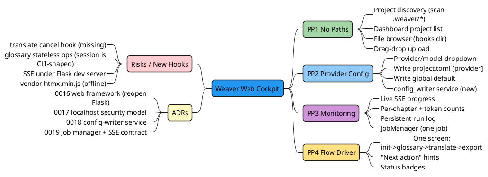

# Feature Plan — Phase 12: Local Web Cockpit

> **⚠️ Dated snapshot (2026-05-29).** This document is superseded by the three split web-* documents for active development:
> [web-feature-plan.md](web-feature-plan.md) · [web-architecture.md](web-architecture.md) · [web-execution-blueprint.md](web-execution-blueprint.md).
> Those are the living source of truth. This file is kept only as the original planning record — do not edit it for ongoing changes.

**Status:** Draft (planning). Not yet scheduled.
**Target version:** `0.5.0`
**Surface decision:** Local web dashboard (full cockpit). CLI stays fully supported and additive.
**Backend decision:** Flask (sync) + locked Jinja2 + HTMX + threading + Server-Sent Events (SSE).
**Date:** 2026-05-29

---

## 1. Why

Daily use of the Weaver CLI carries four confirmed friction points (all rated painful by the maintainer):

| ID  | Pain | Code evidence |
|-----|------|---------------|
| PP1 | Every command after `init` needs the full `.weaver/<name>/project.toml` path. No active-project context, no discovery. | `cli/main.py` — every command takes `project_toml: Path` |
| PP2 | No `weaver config` command. Provider/model change = hand-edit TOML or `--provider/--model` each run. Global config resolver exists but **nothing writes it**. `weaver new` wizard collects provider then discards it. | `core/global_config.py` (read-only), `services/wizard.py:58` vs `cli/main.py:171`, `services/project.py:262` (hardcoded `deepseek` + stray ollama `base_url`) |
| PP3 | Translate progress bar is `transient=True` — vanishes after run. Status only post-hoc via `inspect`/`dashboard`. No live per-chapter view, no log. | `cli/main.py:376` |
| PP4 | `init` → `glossary review` → `translate` → `export` are separate long-path commands. No "do next thing" driver. | command set in `cli/main.py` |

**Goal:** one local browser cockpit that removes all four frictions for daily use, reusing the existing `services/` core so logic is never duplicated.

---

## 2. Scope (locked decisions)

| Decision | Choice |
|----------|--------|
| Primary surface | Local web dashboard, full cockpit (browser does everything; CLI optional) |
| Backend | Flask (sync only) + Jinja2 + HTMX + threading + SSE |
| File input | **Both**: server-side directory browser (rooted at configurable books dir) **and** drag-drop upload |
| Translate concurrency | **One job at a time** (global single job; others blocked/queued) |
| Provider/model config write | **Both, UI-selectable**: per-project (`project.toml`) or global default (`~/.weaver/config.toml`) |
| Execution shape | **Phased sub-sprints** 12a → 12b → 12c |
| Security | Bind `127.0.0.1` only. No remote bind. Single-user. No auth. File browser sandboxed to a root. |

**Explicitly out of scope:** multi-user, auth, remote access, cloud deploy, async/await, React/Node build step, websockets, packaging the server as a service/daemon.

---

## 3. Feature Mind Map

---

## 4. Architecture

Thin web layer over the existing service core. Flask routes call the same `services/` functions the CLI uses. New pieces: `JobManager` (in-memory, threaded, one-job-at-a-time), `config_writer` service, `project_discovery`, `file_browser`.

USER LAYER — Browser (localhost:8765)

Dashboard <small>project list</small>

New Project <small>browse + upload</small>

Project Cockpit <small>status + actions</small>

Glossary Review <small>approve/edit</small>

HTMX + Jinja2 templates + vendored htmx.min.js + minimal CSS (no build step)

HTTP / SSE &#8595;&#8593;

APPLICATION LAYER — Flask (sync, threaded, 127.0.0.1)

routes_projects <small>discover/view</small>

routes_new <small>browse/upload/init</small>

routes_translate <small>start/stop/SSE</small>

routes_config <small>provider/model</small>

routes_glossary

routes_export

JobManager <small>1 job, threading, queue</small>

function calls &#8595;

SERVICE LAYER — existing core (shared with CLI)

translate_project <small>+ cancel hook (new)</small>

initialize_project

glossary_review <small>+ stateless ops (new)</small>

export_markdown/epub

config_writer <small>NEW: atomic TOML write</small>

project_discovery <small>NEW: scan .weaver/*</small>

file_browser <small>NEW: sandboxed listing</small>

reads / writes &#8595;

DATA LAYER

SQLite WAL <small>weaver.db</small>

project.toml <small>[provider] etc</small>

~/.weaver/config.toml <small>global default</small>

glossary TSV

provider API &#8595;

EXTERNAL — providers (unchanged)

deepseek

gemini

ollama

fake

**Key principle:** the web layer holds **zero translation/glossary/export logic**. It only routes HTTP, manages job lifecycle, and renders HTML. All domain logic stays in `services/`. CLI and web are two front-ends over one core.

---

## 5. New Modules (one concept per file, <400 lines each)

| Path | Concern |
|------|---------|
| `src/weaver/web/__init__.py` | package marker |
| `src/weaver/web/app.py` | Flask app factory + blueprint registration + `127.0.0.1` bind |
| `src/weaver/web/routes_projects.py` | dashboard, project discovery list, project cockpit view |
| `src/weaver/web/routes_new.py` | file browser + upload + init trigger |
| `src/weaver/web/routes_translate.py` | start/stop job, SSE event stream |
| `src/weaver/web/routes_config.py` | set provider/model (project or global) |
| `src/weaver/web/routes_glossary.py` | paginated candidate list + approve/edit/reject |
| `src/weaver/web/routes_export.py` | trigger markdown/epub export |
| `src/weaver/web/job_manager.py` | in-memory job registry, threading, single-job lock, progress queue |
| `src/weaver/web/file_browser.py` | sandboxed directory listing, `.epub` filter |
| `src/weaver/web/templates/*.html` | Jinja2 templates (dashboard, new, cockpit, glossary) |
| `src/weaver/web/static/*` | vendored `htmx.min.js`, CSS |
| `src/weaver/services/config_writer.py` | **NEW** atomic writer for `[provider]` in `project.toml` + global config |
| `src/weaver/services/project_discovery.py` | **NEW** scan `.weaver/*/project.toml`, return summaries (also usable by a future CLI `--active`) |

CLI gains one command: `weaver serve [--port 8765] [--books-dir PATH] [--no-browser]` in `cli/main.py`.

---

## 6. HTTP Routes

| Method | Path | Action | Service called |
|--------|------|--------|----------------|
| GET | `/` | Dashboard: discovered projects + global provider default | `project_discovery` |
| GET | `/new` | New-project page (file browser + upload form) | `file_browser` |
| GET | `/api/browse?dir=` | JSON dir listing (sandboxed, `.epub` filter) | `file_browser` |
| POST | `/new/init` | Init from browsed path or uploaded file | `initialize_project` |
| GET | `/project/<name>` | Cockpit: status, provider/model, action buttons | `inspect_project` |
| POST | `/project/<name>/config` | Set provider/model (scope=project\|global) | `config_writer` |
| POST | `/project/<name>/translate` | Start translate job (retry/first-N options) | `JobManager` → `translate_project` |
| POST | `/project/<name>/translate/stop` | Cooperative cancel | `JobManager` |
| GET | `/project/<name>/events` | **SSE** live progress stream | `JobManager` queue |
| GET | `/project/<name>/glossary` | Paginated pending candidates | `glossary_review` (stateless) |
| POST | `/project/<name>/glossary/<id>` | approve/edit/reject one candidate | `glossary_review` (stateless) |
| POST | `/project/<name>/export` | Export markdown or epub | `export_markdown/epub_project` |

**SSE contract** (`text/event-stream`):
- `event: progress` → `{current, total, segment_id, status, input_tokens, output_tokens}`
- `event: done` → `{selected, translated, failed, pending, stale, input_tokens, output_tokens}`
- `event: error` → `{message}`

---

## 7. Required service-core changes (carefully scoped, wire-compatible)

These are the only changes outside the new `web/` package. Each is additive.

1. **`services/translation.py` — cancel hook.** `translate_project` currently runs to completion with no cancel path. Add an optional `should_cancel: Callable[[], bool] | None` checked between segments. CLI passes `None` (no behavior change). Web passes the JobManager flag. Needed for the stop button.
2. **`services/glossary_review.py` — stateless ops.** The current `GlossaryReviewSession` is a context manager shaped for the CLI interactive loop. Add stateless helpers: `list_pending(project_toml, *, offset, limit)` and `act_on_candidate(project_toml, candidate_id, action, target=None, notes=None)`. CLI loop stays untouched.
3. **`services/wizard.py` / `services/project.py` — fix discarded provider (PP2 bug).** `weaver new` collects provider then drops it; generated `project.toml` hardcodes `deepseek` + a stray ollama `base_url`. `config_writer` + `initialize_project(provider=...)` fixes both. (Small, can land in 12b.)

---

## 8. ADRs to author (before matching implementation)

| ADR | Decision |
|-----|----------|
| `0016-web-cockpit-framework.md` | Reopen stack: allow **Flask (sync)** + HTMX; keep Jinja2 (already locked); **asyncio stays rejected**; React/Node stays rejected. Rationale: thin local UI, sync fits sync services. |
| `0017-localhost-security-model.md` | Bind `127.0.0.1` only; no auth (single-user local); file browser sandboxed to `--books-dir` root; upload size/type limits; never log API keys to the page. |
| `0018-config-writer-service.md` | Atomic (`tempfile`+`replace`) writes to `project.toml [provider]` and `~/.weaver/config.toml`; preserve unrelated keys; keys never written to config (env-only rule holds). |
| `0019-job-manager-progress-streaming.md` | In-memory single-job registry; one-job-at-a-time lock; progress via thread-safe queue; SSE contract above; cooperative cancel. |

---

## 9. Sub-sprints

### Phase 12a — Discovery + Read-only Monitor (foundation)
**Deliverables:**
- `weaver serve` command, Flask app factory, `127.0.0.1` bind, `--no-browser`.
- `project_discovery` service + Dashboard listing discovered projects (**kills PP1**).
- Project cockpit view (read-only): status table mirroring `inspect`.
- `JobManager` skeleton + SSE endpoint streaming a translate job started **read-only** (no stop yet) (**starts PP3**).
- ADRs `0016`, `0017`, `0019`. Vendored `htmx.min.js`.

**Exit:** browse to localhost, see all projects with no path typing; start a translate from the cockpit and watch live SSE progress to completion.

### Phase 12b — Actions: config, translate controls, export, file input
**Deliverables:**
- File browser (`/api/browse`) + drag-drop upload + `/new/init` (**finishes PP1**, file picker).
- `config_writer` service + provider/model UI (project + global scope) + wizard/`project.toml` provider-discard fix (**kills PP2**). ADR `0018`.
- Translate controls: retry-failed, first-N, **stop** (cancel hook in `translation.py`).
- Export buttons (markdown/epub) + "next action" flow hints (**kills PP4**).

**Exit:** create a project from the browser (browse or upload), set its provider/model from a dropdown, translate with stop/retry, export — without touching the CLI.

### Phase 12c — Glossary Review UI
**Deliverables:**
- Stateless glossary ops in `services/glossary_review.py`.
- Paginated browser review UI: approve / edit / reject / find (**finishes PP5**, the most tedious CLI part).
- Glossary conflicts + diff surfaced read-only in the cockpit.

**Exit:** full glossary review done comfortably in the browser; conflicts visible before translate.

---

## 10. Reusable Phase Gate (per §2.2 of CLAUDE.md)

For each sub-sprint, before closing:
1. Read sub-sprint deliverables here + plan source.
2. List exit criteria in plain language.
3. Verify each with a concrete command / browser check / test.
4. State what is usable now vs internal-only.
5. Update CLAUDE.md §2.1 / §2.3 / §2.4 / §2.5 on pass.

**Global exit criteria (all of 12):**
1. ADRs `0016`–`0019` land per ENGINEERING_STANDARDS format.
2. All PRs green; one PR = one concern.
3. AC-1..AC-9 acceptance gate stays PASS.
4. Ruff lint + format clean. Pyright `0 errors`.
5. CLI remains fully wire-compatible (existing tests unchanged).
6. README + `docs/quickstart.md` document `weaver serve`.
7. New deps gated behind optional extra `weaver[web]`.

---

## 11. Risks & Open Questions

| Risk | Note | Mitigation |
|------|------|------------|
| Flask built-in dev server + SSE threading | Dev server is single-threaded by default; prints a "not for production" warning. | **Decided (D1): use Flask dev server with `threaded=True`.** No extra dep. Warning is harmless for localhost single-user. |
| `translate_project` has no cancel path | Stop button needs cooperative cancel. | Add `should_cancel` hook (§7.1); land in 12b. |
| Glossary session is CLI-shaped | Context-manager loop, not per-request. | Add stateless ops (§7.2); land in 12c. |
| HTMX from CDN breaks offline ethos | Project is offline-capable. | Vendor `htmx.min.js` in `static/`. |
| File browser path traversal | Browser lists local FS. | Sandbox to `--books-dir`; reject `..` escapes; ADR `0017`. |
| Upload location | Where do uploaded EPUBs land? | **Decided (D2): copy upload into `.weaver/_uploads/`, then run `init` from there.** Keeps original out of the project tree. |
| Single-job lock UX | Second translate request while one runs. | Block with clear message + show running job link; queue is out of scope for v1. |

**Decisions resolved by maintainer:**
- D1 ✅ Flask dev server with `threaded=True` (no extra dep; accept dev-server warning).
- D2 ✅ Uploaded EPUB copied to `.weaver/_uploads/`, then `init` runs from there.
- D3 ✅ Optional extra named `weaver[web]` (matches `[tui]`/`[wizard]`/`[all]`).

---

## 12. Stack delta

**Add (behind `weaver[web]` extra):** `flask` only. `htmx.min.js` vendored in `static/` (not a pip dep). No `waitress` (D1: Flask dev server).
**Reaffirm rejected:** asyncio, FastAPI, React/Node build, Django, websockets.
**Reuse from locked stack:** Jinja2, pydantic, sqlite3 (WAL), all `services/`.
