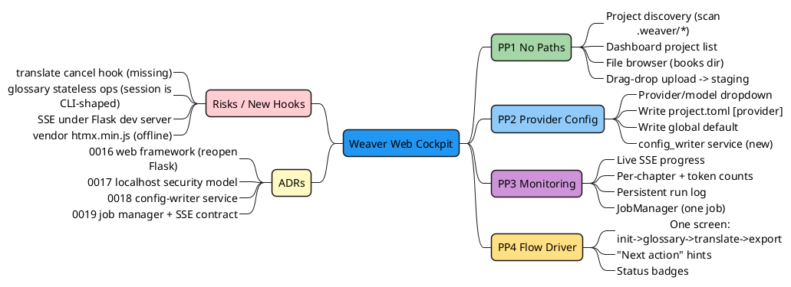

# Web Cockpit — Feature Plan

**Phase:** 12 · **Target version:** `0.5.0` · **Status:** Draft (planning, not scheduled)
**Companion docs:** [web-architecture.md](web-architecture.md) · [web-execution-blueprint.md](web-execution-blueprint.md) · [master plan](2026-05-29-web-cockpit-phase-12.md)

This doc owns the **what & why**. Architecture (how it's built) lives in [web-architecture.md](web-architecture.md); build order (when/how shipped) lives in [web-execution-blueprint.md](web-execution-blueprint.md).

---

## 1. Why

Daily CLI use carries four confirmed friction points, all rated painful by the maintainer.

| ID  | Pain | Code evidence |
|-----|------|---------------|
| PP1 | Every command after `init` needs the full `.weaver/<name>/project.toml` path. No active-project context, no discovery. | `cli/main.py` — every command takes `project_toml: Path` |
| PP2 | No `weaver config` command. Provider/model change = hand-edit TOML or `--provider/--model` each run. Global config resolver exists but **nothing writes it**. `weaver new` wizard collects provider then discards it. | `core/global_config.py` (read-only), `services/wizard.py:58` vs `cli/main.py:171`, `services/project.py:262` (hardcoded `deepseek` + stray ollama `base_url`) |
| PP3 | Translate progress bar is `transient=True` — vanishes after run. Status only post-hoc via `inspect`/`dashboard`. No live per-chapter view, no log. | `cli/main.py:376` |
| PP4 | `init` → `glossary review` → `translate` → `export` are separate long-path commands. No "do next thing" driver. | command set in `cli/main.py` |

(PP5 — glossary review tedium — rides along in Phase 12c.)

**Goal:** one local browser cockpit that removes all four frictions for daily use, reusing the existing `services/` core so logic is never duplicated.

---

## 2. Scope — locked decisions

| Decision | Choice |
|----------|--------|
| Primary surface | Local web dashboard, full cockpit (browser does everything; CLI optional) |
| Backend | Flask (sync only) + Jinja2 + HTMX + threading + SSE |
| File input | **Both**: server-side directory browser (rooted at configurable books dir) **and** drag-drop upload |
| Translate concurrency | **One job at a time** (global single job; others blocked) |
| Provider/model config write | **Both, UI-selectable**: per-project (`project.toml`) or global default (`~/.weaver/config.toml`) |
| Execution shape | **Phased sub-sprints** 12a → 12b → 12c |
| Security | Bind `127.0.0.1` only. No remote bind. Single-user. No auth. File browser sandboxed to a root. |
| Server (D1) | Flask dev server, `threaded=True`. No `waitress`. |
| Upload dest (D2) | Copy upload → `.weaver/_uploads/`, then `init` from there. |
| Optional extra (D3) | `weaver[web]` (matches `[tui]`/`[wizard]`/`[all]`). |

**Out of scope:** multi-user, auth, remote access, cloud deploy, async/await, React/Node build step, websockets, daemon/service packaging, job queue (single-job only).

---

## 3. Feature mind map

---

## 4. Success criteria (user-visible)

- **PP1 gone:** open the browser, see every project; create one without typing a path (browse or upload).
- **PP2 gone:** switch provider/model from a dropdown; choose project-scope or global default.
- **PP3 gone:** watch live translate progress (per-segment, per-chapter, token counts) that persists.
- **PP4 gone:** drive `init → glossary → translate → export` from one cockpit screen.
- **CLI untouched:** every existing CLI command stays wire-compatible; web is purely additive.

---

## 5. Stack delta

**Add (behind `weaver[web]` extra):** `flask` only. `htmx.min.js` vendored in `static/` (not a pip dep). No `waitress` (D1).
**Reuse from locked stack:** Jinja2, pydantic, sqlite3 (WAL), all `services/`.
**Reaffirm rejected (no reintroduction):** asyncio, FastAPI, React/Node build, Django, websockets.
**Stack-lock note:** Flask is currently in the CLAUDE.md §3 *rejected* list. Phase 12 reopens it **only via ADR `0016`**. Until `0016` lands, Flask is *planned*, not locked-in.
